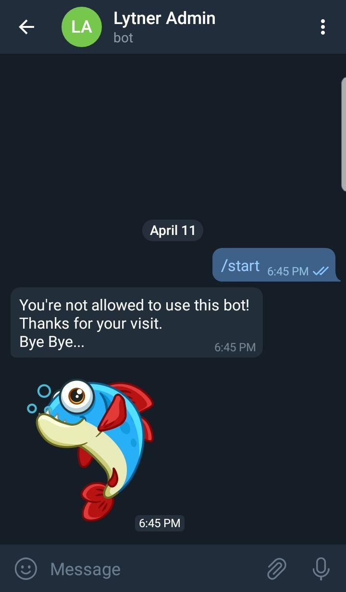
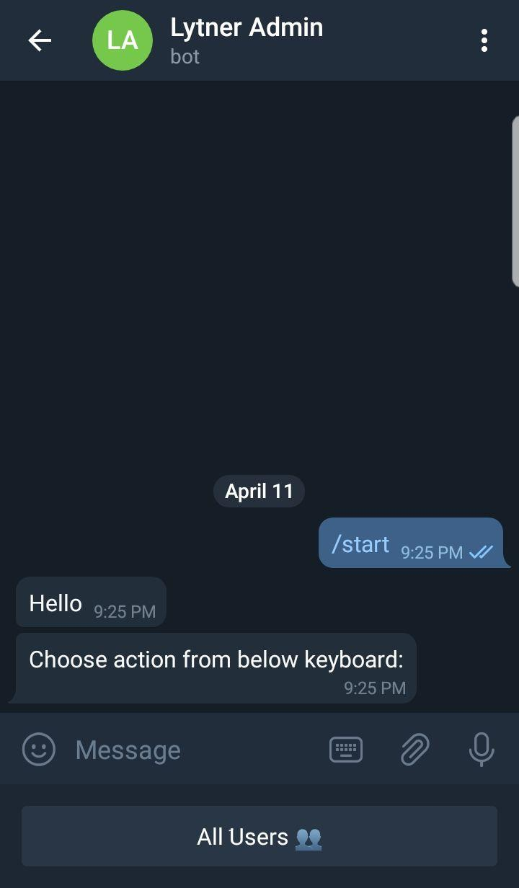

### Leitner Box
This is a fully functioning Leitner box that can be used to help you memorize 
words a lot easier.
In current version (***v.1.1***) you can:
* Add, modify and delete categories
* Add new words to specific category
* Admins can pull categories from one user to another one from their `home` page.

#### Instructions
Follow these steps on your server:
```shell script
cd /var/www/
git clone https://github.com/FarzamTP/Leitner.git
cd Leitner
sudo sh preparations.sh
```
This will clone this repository and prepare your server to host this web app.

#### Updates
***v.1.2***:
* Now you can use [Bot](./bot.py) to view or delete current users and categories!
    * You only need to create your new bot at [BotFather](https://t.me/botfather) and command `/newBot`. <br>
    Then after you got your `TOKEN`, you should put in `your_token` section in `bot.py`.
    If you want this application to be run on your server, you should take care of the `your_site` variable. (e.g. it this app, I‌ used https://lytner.ir as my url site).
    * If you want it to be run locally, you just need to set it equal to `https://localhost:port`.
    * You should take into notice that you need to be `superuser` to use the bot. to change it, you should edit 
    `ALLOWED_CHAT_IDs` in `bot.py`.




As you see the recipient's `Chat_id` is nor in `ALLOWED_CHAT_IDs`.



This a sample of an allowed user that need to be authenticated later.

**Note:** For further information if you want to check out a real, working version of the application,
contact me via [Email](mailto:farzam.taghipour@gmail.com) or [Telegram](https://t.me/FarzamTaghipour).